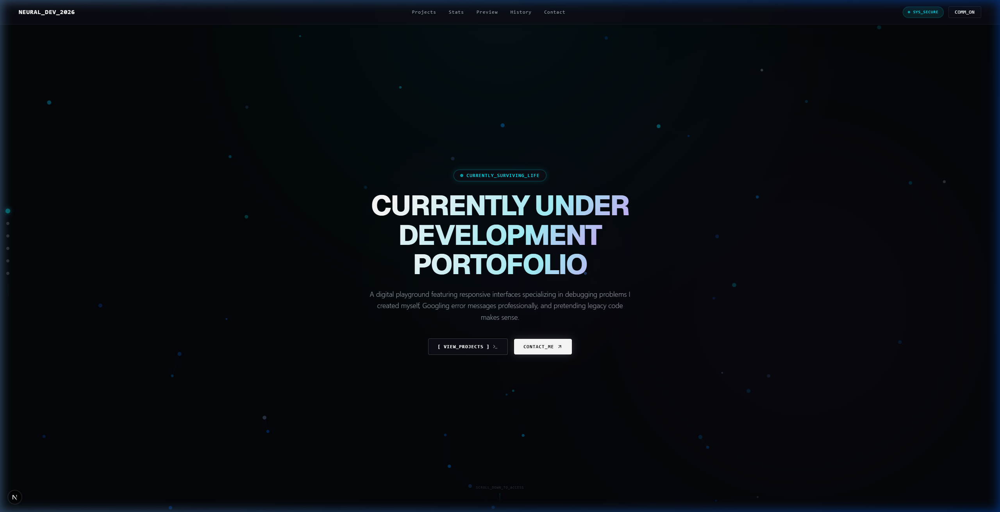

# Antigravity Portfolio

A professional, interactive portfolio website built with Next.js, Framer Motion, and Tailwind CSS. The design showcases both systems programming expertise and creative video editing skills, featuring a high-performance, dark-themed "hacker" aesthetic with smooth parallax scroll animations.

## Tech Stack
- **Framework**: Next.js 16 (React 19)
- **Styling**: Tailwind CSS 4
- **Animations**: Framer Motion
- **Icons**: Lucide React
- **Language**: TypeScript

## Architecture & Components
The site is built as a single-page scrolling experience (`src/app/page.tsx`) utilizing several interactive components:

- **`FloatingNav.tsx`**: Sticky navigation bar.
- **`Navbar.tsx`**: Main header navigation.
- **`Hero.tsx`**: Landing section with initial parallax introduction.
- **`Deployments.tsx`**: Section showcasing deployments and live systems.
- **`Integrity.tsx`**: Systems programming section featuring a floating, parallax-enabled layout.
- **`ProjectPreview.tsx`**: Showcase of projects and work.
- **`History.tsx`**: Work experience and background.
- **`Contact.tsx`**: Interactive terminal-style contact interface.
- **`Footer.tsx`**: Page footer.

### Animation System
The site uses a unified parallax scrolling system.
- **`ParallaxWrapper.tsx`**: A wrapper component that applies opacity mapping and scroll-based distance mapping to elements, ensuring smooth GPU-accelerated motion and maintaining a cohesive visual flow.

## Local Development

Follow these steps to run the portfolio website locally:

1. **Install Dependencies**:
   Ensure you have Node.js installed, then install the package dependencies:
   ```bash
   npm install
   ```

2. **Run Development Server**:
   Start the Next.js development server:
   ```bash
   npm run dev
   ```
   *Note for Windows users:* If you hit a `PSSecurityException` script execution policy restriction in PowerShell, run this command instead:
   ```powershell
   cmd.exe /c npm run dev
   ```

3. **Verify Locally**:
   Open [http://localhost:3000](http://localhost:3000) in your web browser.

### Application Preview
Here is a live screenshot preview of the portfolio's Hero section:



## Changelog

**[2026-05-17]**
- Initialized the `README.md` with comprehensive project documentation.
- Created core documentation structure to be maintained continuously.
- Added step-by-step local running guide and embedded a live preview screenshot in `README.md`.
- Stored live preview screenshot under `public/screenshot.png`.

> **AI INSTRUCTION**: Every time a change is made to the codebase, this `README.md` (specifically the Architecture & Components and Changelog sections) must be updated to reflect the latest state.

